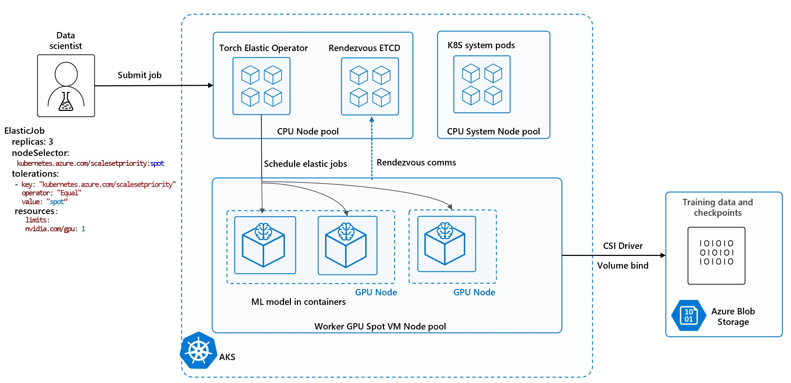

# Elastic PyTorch training on Kubernetes Self Serve Lab

This lab introduces elastic fault tolerant distributed Pytorch training on Kubernetes. With larger and larger models being trained, the need to scale out to a distributed cluster is increasingly important. Distributed training on multiple high performance computing instances can significantly reduce the time to train modern deep neural networks with large dataset. Running training on low cost [**Azure Spot VMs**](https://docs.microsoft.com/en-us/azure/virtual-machines/spot-vms) will further cut the costs.

Kubernetes enables machine learning teams to run training jobs distributed across fleets of powerful GPU instances. However, typical distributed training jobs are not fault tolerant, and a job cannot continue if a node fails or is reclaimed. 

**Elastic Training** takes it further and enables distributed training jobs to be executed in a fault tolerant and elastic manner on Kubernetes nodes that can dynamically change, without disrupting the model training process. [**Pytorch Elastic**](https://pytorch.org/elastic/0.2.2/index.html) module allows users to enable Pytorch training script with elasticity and fault tolerance and it's fully native to Pytorch, user would not need to install additional frameworks like Horovod, Ray or Dask.

# What you'll build
In this Lab, you will build an AKS cluster with GPU enabled Spot VM nodepool and will run elastic distributed Pytorch training job and test how the script survives interruptions when AKS node is evicted.
Upon completion, your infrastructure will contain:

- An [Azure Kubernetes Services](https://docs.microsoft.com/en-us/azure/aks/) (AKS) cluster with 
  - **GPU enabled Spot VM nodepool** for running elastic training
  - **CPU VM nodepool** for running Rendezevous server - training control plane
- Azure Storage Account for hosting training data and model training checkpoints
- Notebooks that create infrastructure and run training jobs 

# What you'll learn
In this lab you will build Cloud Native infrastructure required for running distributed Pytorch jobs, deploy Kubernetes components such as Rendezvous ETCD server and Torch Elastic Kubernetes operator and run the training. Learning include

-	How to train large scale PyTorch model on a cluster of low cost Spot VMs while retaining job reliability.
-	How to run elastic distributed Pytorch training on Kubernetes with TorchElastic operator 
-	Leverage Kubernetes auto-scaling for elastic training jobs to shorten time for training
- Simulate Azure Spot VM eviction and verify elastic training job is not failing

## Key Takeaways:
-	Audience will be able to apply gained knowledge to save money for the customers who are running training jobs on Azure or on premises.

# What you'll need

- A basic understanding of Kubernetes will be helpful but not necessary 
- Azure Subscription with quota for GPU cores
- Linux environment - Windows Sybsystem for Linux or DSVM or Azure ML Compute instance
- Azure CLI

# Lab Steps
- [Step 0](/Step0-Env.md): Lab Environment Setup 
- [Step 1](/Step1-Setup.ipynb): Infrastructure Setup (AKS + Spot VM Nodepool) and Torch Elastic
- [Step 2](/Step2-DistributedTraining.md): Adjust script for Elastic training 
- [Step 3](/Step3-RunJob.ipynb): Run Torch Elastic ImageNet training on Spot VM Pool
- [Step 4](/Step4-SimulateStop.ipynb): Simulate node eviction and verify training is unaffected

## References
[Torch Elastic Docs](https://pytorch.org/elastic/0.2.2/index.html)

[Azure Spot VMs](https://docs.microsoft.com/en-us/azure/virtual-machines/spot-vms)
